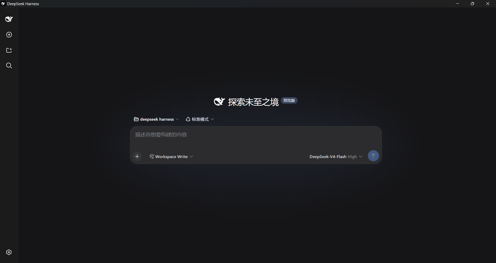

# 🐋 DeepSeek Harness Desktop

> **把 [DeepSeek Harness](https://github.com/deepseek-ai/deepseek-harness) 打包成类 Codex 的桌面应用** —— 原生窗口、系统托盘、关窗进托盘、托盘退出才彻底关停。

<p align="center">
  
</p>

<p align="center">
  
</p>

[](https://github.com/ethanweave/dsh-desktop/releases)
[](https://github.com/ethanweave/dsh-desktop/releases)
[](https://www.electronjs.org/)
[](LICENSE)

厌倦了在浏览器标签页里用 DeepSeek Harness？这个应用把 `dsh web` 封装成**原生桌面应用**，体验对标 Codex：真正的窗口、系统托盘图标、完全由你掌控的生命周期。

## ✨ 特性

| | 特性 | 说明 |
|---|---|---|
| 🖥️ | **原生窗口** | 无地址栏、无菜单栏——像真正的桌面应用，而不是浏览器标签页 |
| 🧭 | **系统托盘常驻** | 点 ❌ 只是隐藏窗口，后台服务与托盘保持运行 |
| 🚀 | **零依赖安装** | dsh 运行时随包分发——用户**无需安装 Node.js / npm** |
| 🛑 | **彻底关停** | 只有托盘右键 → **退出** 才真正停止服务并退出应用 |
| 🔄 | **自动恢复** | 启动时自动拉起 `dsh web` 服务；崩溃自动检测 |
| 🔒 | **单实例** | 重复启动只聚焦已有窗口，不会开多个 |

## 🤔 为什么不用浏览器？

| | 浏览器标签页 | 本应用 |
|---|---|---|
| 窗口 | 浏览器里的一个标签 | 独立原生窗口 |
| 关闭 | 丢失现场 | 隐藏到托盘，秒开恢复 |
| 后台 | 必须开着浏览器 | 服务独立托管 |
| 观感 | 到处是浏览器边框 | 干净的桌面应用 |

## 📥 下载安装

从 [Releases](../../releases) 下载 **`DeepSeek-Harness-Setup-x.y.z.exe`**：

1. 双击安装程序
2. 桌面出现 **DeepSeek Harness** 图标
3. 完成 —— 无需 Node.js、无需 npm、无需配置

> 安装包内置完整 dsh 运行时（约 150MB），任何干净的 Windows 机器都能直接用。

## 🎮 使用

| 操作 | 行为 |
|---|---|
| **双击** 桌面图标 | 打开界面（服务未运行自动拉起） |
| 点窗口 **❌** | 隐藏到系统托盘——后台服务不中断 |
| **双击** 托盘图标 | 重新显示窗口 |
| **托盘右键 → 退出** | **彻底关停** —— 关窗口 + 停服务 + 退出应用 |

## 🛠 从源码构建

前置要求：Node.js ≥ 20、npm。

```bash
# 1. 安装构建依赖（electron + electron-builder）
npm install

# 2. 安装 dsh 运行时（随安装包分发）
cd runtime && npm install --omit=dev && cd ..

# 3. 打包 NSIS 安装程序（输出到 dist/）
npm run dist
```

> 国内网络可加镜像：`npm install --registry=https://registry.npmmirror.com`

## ⚙️ 环境变量（可选）

| 变量 | 说明 | 默认 |
|---|---|---|
| `DSH_WEB_PORT` | 服务端口 | `3080` |
| `DSH_WORKSPACE` | 服务工作目录 | 用户主目录 |

## 🔧 工作原理

主进程（`main.js`）拥有 dsh web 服务的**完整生命周期**：

```
启动 → 端口检测 →（未运行？）→ spawn dsh web → 等待就绪 → 打开窗口
                                              │
退出 ← 托盘退出 ← 隐藏 ← ❌ 点击 ← 打开窗口
   │
   └─ 进程树清理 + 端口兜底清理（双保险）
```

- 服务用 **Electron 自带的 node 内核**运行（`ELECTRON_RUN_AS_NODE` + `--expose-internals`），无需系统级 Node.js
- dsh 运行时位于 `<resources>/dsh-runtime`（安装版）或 `./runtime`（开发模式）
- `afterPack` 钩子把运行时复制进安装包，绕开 electron-builder 对 node_modules 的排除

## 📦 项目结构

```
├── main.js               # 主进程：窗口 + 托盘 + 服务生命周期
├── runtime/              # dsh 运行时（打进安装包）
├── scripts/afterPack.js  # electron-builder 钩子：复制运行时
├── assets/               # 品牌 logo（蓝底白鲸鱼）+ 应用截图
└── dist/                 # 构建产物（安装程序 .exe）
```

## 📄 致谢与许可

- 核心引擎：[DeepSeek Harness](https://github.com/deepseek-ai/deepseek-harness)（MIT License, Copyright (c) 2026 DeepSeek）
- Logo：DeepSeek Harness 官方品牌（[deepseek-ai](https://github.com/deepseek-ai)）
- 本桌面壳：[MIT License](LICENSE)

---

⭐ 如果这个项目让你少开了一个浏览器标签页，欢迎点个 star —— 帮更多人找到它。
